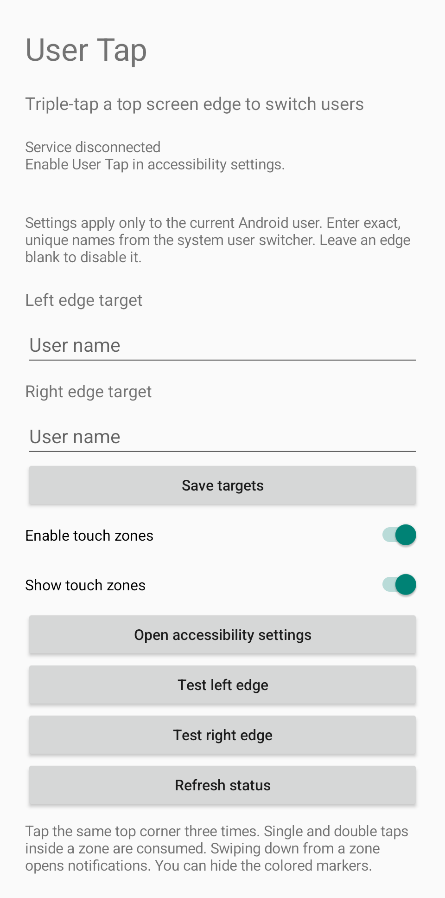
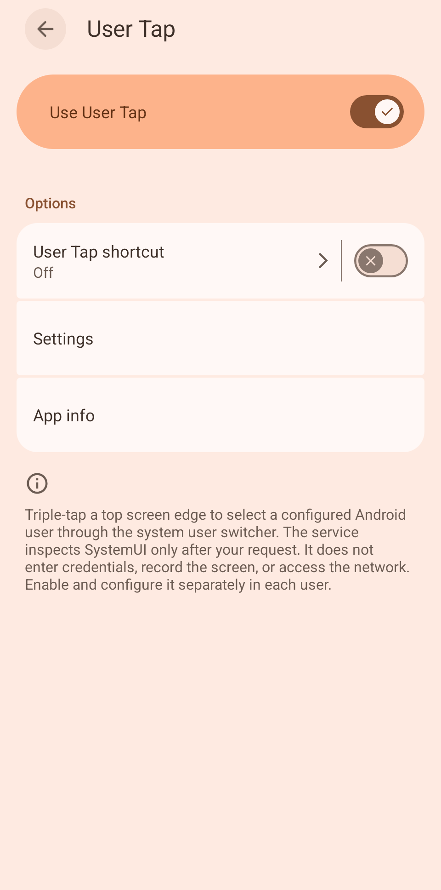

# User Tap

Triple-tap either top screen edge to switch Android users on GrapheneOS. Uses the system user switcher through Accessibility; no root, Shizuku, or persistent ADB connection.

## Setup

Install the APK in each user. Open User Tap, enter an exact user name for each edge, save, and enable its accessibility service. Settings are local to each user. A blank target disables that edge. Use distinct user names.

Colored touch zones can be hidden. Single and double taps inside a zone are consumed; a downward swipe opens notifications. Switching does not end the previous user's session or bypass its lock screen.

Known issue: after switching users, touch zones may require opening the app and pressing **Save targets** again.

Accessibility is a broad permission. This app only inspects SystemUI after a switching request and has no network permission. It depends on GrapheneOS's user-switcher view IDs, which may change between releases.

 

## Build

Requires Python 3.9+, JDK 17+, Android SDK Platform 35 and Build Tools 35.0.0.

```sh
export ANDROID_SDK_ROOT=/path/to/android-sdk
python3 build.py
```

Output: `build/user-tap.apk`. The build runs gesture tests and verifies the APK signature. Keep the generated `signing/local.keystore` to sign future updates; build outputs and signing keys are ignored by Git.
