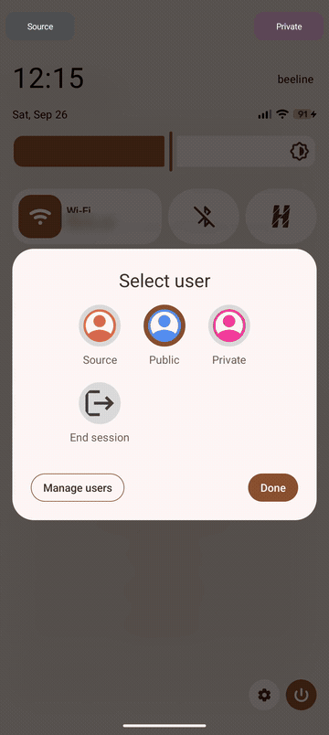
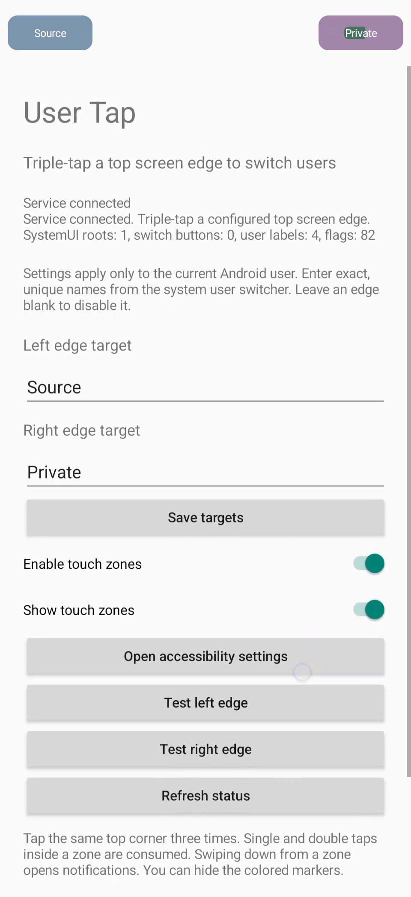
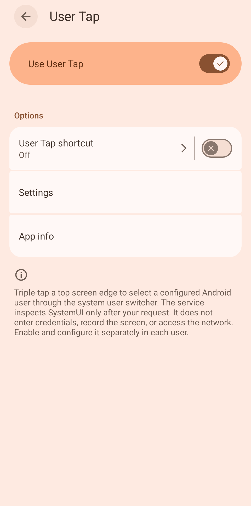

# User Tap

Triple-tap either top screen edge to switch Android users on GrapheneOS. Uses the system user switcher through Accessibility; no root, Shizuku, or persistent ADB connection.



[MP4 version (10 seconds, 2× speed)](media/demo.mp4)

## Setup

Install the APK in each user. Open User Tap, enter an exact user name for each edge, save, and enable its accessibility service. Settings are local to each user. A blank target disables that edge. Use distinct user names.

If you use Happ, enable **Disconnect Happ before switching** in each user. User Tap opens Happ's `disconnect_without_ui` link before showing the system user switcher. It does not start Happ in the destination user; if the switch fails, Happ remains disconnected in the original user.

Colored touch zones can be hidden. Single and double taps inside a zone are consumed; a downward swipe opens notifications. Switching does not end the previous user's session or bypass its lock screen.

Accessibility is a broad permission. This app only inspects SystemUI after a switching request and has no network permission. It depends on GrapheneOS's user-switcher view IDs, which may change between releases.

 

## Build

Requires Python 3.9+, JDK 17+, Android SDK Platform 35 and Build Tools 35.0.0.

```sh
export ANDROID_SDK_ROOT=/path/to/android-sdk
python3 build.py
```

Output: `build/user-tap.apk`. The build runs gesture tests and verifies the APK signature. Keep the generated `signing/local.keystore` to sign future updates; build outputs and signing keys are ignored by Git.

The **Build APK** GitHub Action builds on pushes to `main` and can also be run manually. Download its APK from the workflow run's artifacts. By default, CI signs with a temporary key (`user-tap-test-apk`), which cannot update an existing installation. To build update-compatible APKs, store a base64-encoded copy of your local `signing/local.keystore` as the repository secret `USER_TAP_KEYSTORE_BASE64` (for example, `base64 < signing/local.keystore | gh secret set USER_TAP_KEYSTORE_BASE64`). Builds on `main` will then use that key and upload `user-tap-update-apk`.
